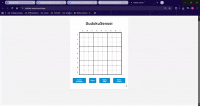

# SudokuSensei

<div align="center">


*A comprehensive Sudoku solver demonstrating advanced algorithmic techniques and full-stack development*

</div>

## Project Overview

SudokuSensei is a sophisticated educational Sudoku solver built with modern software engineering practices. It demonstrates advanced algorithm implementation, clean architecture design, and full-stack development capabilities. The application provides step-by-step puzzle solving with detailed explanations of logical techniques applied.

<div align="center">



*Interactive solving demonstration with real-time validation and technique explanations*

**[View High-Quality Video Demo](media/Sudoku_Sensei_Solve.mp4)**

</div>

## Key Technical Highlights

### **Advanced Algorithm Implementation**
- **Constraint Propagation**: Efficient candidate elimination using mathematical set operations
- **Logical Technique Engine**: Implementation of complex Sudoku solving algorithms:
  - Naked Singles & Hidden Singles
  - Naked Pairs & Hidden Pairs  
  - Naked Triples with advanced constraint satisfaction
- **Backtracking with Optimization**: Intelligent search space pruning
- **Data Structure Design**: Custom board representation with optimized memory usage

### **Software Engineering Best Practices**
- **Clean Architecture**: Separation of concerns with distinct service, logic, and API layers
- **Type Safety**: Comprehensive Pydantic models with validation
- **Error Handling**: Robust exception management with detailed user feedback
- **Testing Framework**: Comprehensive test suite with pytest
- **Code Documentation**: Extensive docstrings and inline comments

### **Full-Stack Development**
- **Backend**: Python FastAPI with asynchronous request handling
- **Frontend**: React/Next.js with TypeScript integration
- **API Design**: RESTful endpoints with OpenAPI documentation
- **Real-time Updates**: Dynamic UI state management

## Architecture Overview

```
┌─────────────────┐    HTTP/REST    ┌─────────────────┐
│   Frontend      │◄───────────────►│   Backend API   │
│   (React/Next)  │                 │   (FastAPI)     │
└─────────────────┘                 └─────────────────┘
                                             │
                                             ▼
                                    ┌─────────────────┐
                                    │  Solver Engine  │
                                    │                 │
                                    │ ┌─────────────┐ │
                                    │ │ Logic Layer │ │
                                    │ └─────────────┘ │
                                    │ ┌─────────────┐ │
                                    │ │Board System │ │
                                    │ └─────────────┘ │
                                    │ ┌─────────────┐ │
                                    │ │Validation   │ │
                                    │ │Services     │ │
                                    │ └─────────────┘ │
                                    └─────────────────┘
```

## Technology Stack

### **Backend Technologies**
- **Python 3.8+**: Core application logic and algorithms
- **FastAPI**: High-performance async web framework
- **Pydantic**: Data validation and settings management
- **Uvicorn**: ASGI server for production deployment
- **Pytest**: Comprehensive testing framework

### **Frontend Technologies**  
- **React 19**: Modern UI component framework
- **Next.js 15**: Full-stack React framework with SSR
- **Axios**: HTTP client for API communication
- **TypeScript**: Type-safe JavaScript development

### **Development & Deployment**
- **Git**: Version control with conventional commits
- **Vercel**: Cloud deployment and CI/CD
- **ESLint**: Code quality and style enforcement
- **Virtual Environments**: Isolated Python dependencies

## Quick Start

### Prerequisites
- Python 3.8 or higher
- Node.js 18 or higher
- Git

### Backend Setup

1. **Clone and navigate to backend**:
   ```bash
   git clone <repository-url>
   cd SudokuSensei/backend
   ```

2. **Create virtual environment**:
   ```bash
   python -m venv venv
   # Windows
   venv\Scripts\activate
   # macOS/Linux  
   source venv/bin/activate
   ```

3. **Install dependencies**:
   ```bash
   pip install -r requirements.txt
   ```

4. **Start development server**:
   ```bash
   python -m uvicorn main:app --reload --host 127.0.0.1 --port 8000
   ```
   
   **Or use the convenience script**:
   ```bash
   ./start-dev.bat  # Windows
   ```

### Frontend Setup

1. **Navigate to frontend directory**:
   ```bash
   cd ../frontend
   ```

2. **Install dependencies**:
   ```bash
   npm install
   ```

3. **Start development server**:
   ```bash
   npm run dev
   ```

4. **Access application**: Open [http://localhost:3000](http://localhost:3000)

## API Documentation

### Core Endpoints

| Method | Endpoint | Description | Response |
|--------|----------|-------------|-----------|
| `GET` | `/` | Health check | Service status |
| `GET` | `/health` | Detailed service info | System health metrics |
| `POST` | `/solve` | Complete puzzle solving | Full solution with steps |
| `POST` | `/solve-step` | Single technique application | One solving step |

### Interactive API Documentation
- **Swagger UI**: [http://localhost:8000/docs](http://localhost:8000/docs)
- **ReDoc**: [http://localhost:8000/redoc](http://localhost:8000/redoc)

### Example Request
```json
{
  "puzzle": [
    [5, 3, 0, 0, 7, 0, 0, 0, 0],
    [6, 0, 0, 1, 9, 5, 0, 0, 0],
    [0, 9, 8, 0, 0, 0, 0, 6, 0],
    [8, 0, 0, 0, 6, 0, 0, 0, 3],
    [4, 0, 0, 8, 0, 3, 0, 0, 1],
    [7, 0, 0, 0, 2, 0, 0, 0, 6],
    [0, 6, 0, 0, 0, 0, 2, 8, 0],
    [0, 0, 0, 4, 1, 9, 0, 0, 5],
    [0, 0, 0, 0, 8, 0, 0, 7, 9]
  ]
}
```

## Algorithm Deep Dive

### **Constraint Satisfaction Problem (CSP) Approach**
The solver treats Sudoku as a CSP with:
- **Variables**: 81 cells in the 9x9 grid
- **Domain**: Numbers 1-9 for each cell
- **Constraints**: Row, column, and 3x3 box uniqueness

### **Solving Techniques Implemented**

1. **Naked Singles**: Cells with only one possible candidate
2. **Hidden Singles**: Numbers that can only go in one cell within a unit
3. **Naked Pairs**: Two cells in a unit sharing exactly two candidates
4. **Hidden Pairs**: Two numbers restricted to the same two cells
5. **Naked Triples**: Extension of pairs logic to three cells

### **Performance Optimizations**
- **Constraint Propagation**: Immediate candidate elimination after each move
- **Unit-based Processing**: Efficient row/column/box iteration
- **Early Termination**: Stop when no more logical moves available
- **Memory Efficiency**: Bitwise operations for candidate tracking

## Testing & Quality Assurance

### **Test Coverage**
- **Unit Tests**: Individual algorithm components
- **Integration Tests**: Full solving pipeline  
- **API Tests**: Endpoint functionality and error handling
- **Edge Cases**: Invalid puzzles, multiple solutions, unsolvable cases

### **Run Tests**
```bash
cd backend
python -m pytest tests/ -v
```

### **Code Quality**
```bash
# Linting
npm run lint  # Frontend
flake8 backend/  # Backend (if configured)

# Type checking
npm run type-check  # Frontend TypeScript
```

## Skills Demonstrated

### **Relevant to Software Engineering Roles**

**Algorithm Design & Implementation**
- Complex constraint satisfaction problems
- Graph theory applications (Sudoku as constraint graph)
- Optimization techniques and complexity analysis

**Python Ecosystem Expertise**
- FastAPI for high-performance APIs
- Pydantic for data validation
- Object-oriented design patterns
- Asynchronous programming concepts

**Full-Stack Development**
- RESTful API design and implementation
- Frontend-backend integration
- State management and real-time updates

**Software Engineering Practices**
- Clean code architecture
- Comprehensive error handling
- Test-driven development
- Git workflow and conventional commits

**Problem-Solving & Learning**
- Breaking down complex problems
- Research and implementation of specialized algorithms
- Performance optimization and profiling

## Future Enhancements

- **Advanced Techniques**: Implement X-Wing, Swordfish, and other expert-level strategies
- **Performance Monitoring**: Add metrics collection and performance dashboards
- **Puzzle Generation**: Algorithm to create puzzles with guaranteed unique solutions
- **Multi-threading**: Parallel processing for multiple puzzle solving
- **Machine Learning**: Neural network approach for pattern recognition
- **3D Visualization**: Advanced UI with solving animation

## License

This project is open source and available under the [MIT License](LICENSE).

---

<div align="center">

**Built for algorithmic problem solving and clean code**

*Demonstrates proficiency in Python, algorithms, full-stack development, and software engineering best practices*

</div>
